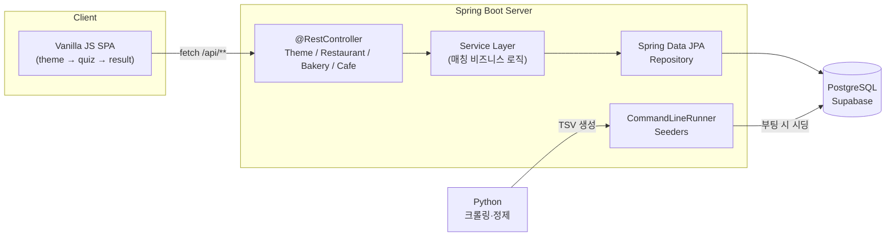
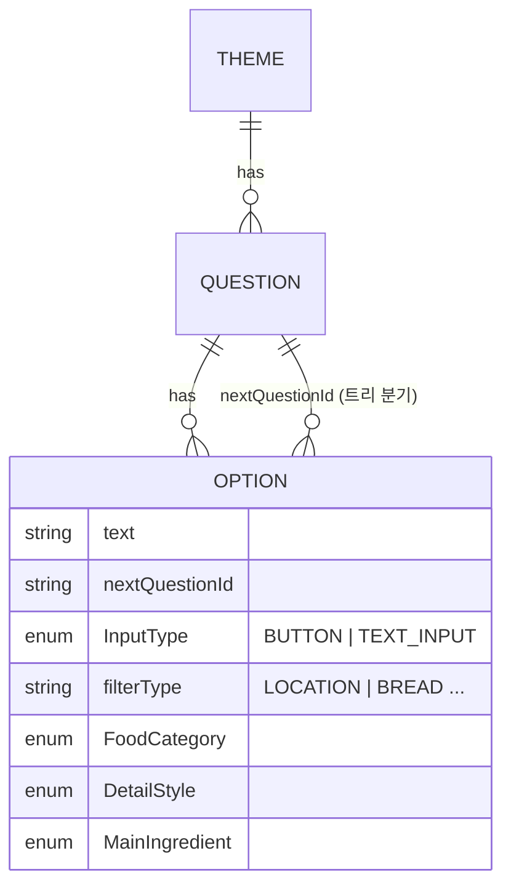
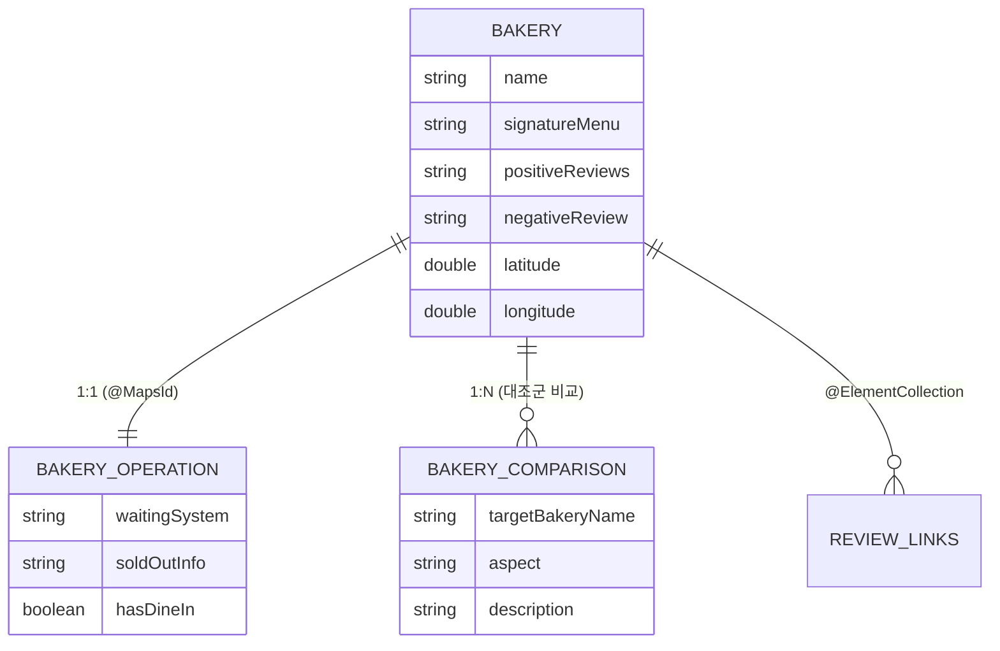

<div align="center">

# 🍽️ MAT — 취향 저격 매치메이커 (Taste Matchmaker)

**"평점 말고 취향." 기분·상황·식감까지 분석해 맛집·빵집·카페를 큐레이션하는 하이브리드 추천 웹 서비스**

<!-- 기술 배지 -->


</div>

---

## 📑 목차

- [한눈에 보기](#-한눈에-보기)
- [기획 의도 & 차별점](#-기획-의도--차별점)
- [핵심 기능](#-핵심-기능)
- [기술 스택](#️-기술-스택)
- [시스템 아키텍처](#️-시스템-아키텍처)
- [데이터 모델링](#️-데이터-모델링-핵심-설계)
- [기술적 도전과 의사결정](#-기술적-도전과-의사결정)
- [API 명세](#-api-명세)
- [디렉토리 구조](#-디렉토리-구조)
- [실행 방법](#-실행-방법)
- [데이터 파이프라인](#-데이터-파이프라인)
- [회고 & 로드맵](#-회고--로드맵)

---

## 🔎 한눈에 보기

| 항목 | 내용 |
| --- | --- |
| **프로젝트 유형** | 개인 프로젝트 (기획 · 설계 · 백엔드 · 프론트 · 데이터 수집 전 과정 단독 수행) |
| **핵심 역할** | 도메인 모델링, REST API 설계, JPA 성능 최적화, 데이터 파이프라인 구축 |
| **백엔드** | Java 17 · Spring Boot · Spring Data JPA · PostgreSQL(Supabase) |
| **프론트엔드** | Vanilla JS 기반 SPA (프레임워크 無) |
| **데이터** | 식당 70여 곳 · 빵집/카페 각 수십 곳, 내돈내산 리뷰 교차검증으로 직접 수집 |
| **Repository** | [github.com/nongba0/MAT_project](https://github.com/nongba0/MAT_project) |

> **이 프로젝트로 보여주고 싶은 것:** 단순 CRUD가 아니라 **도메인 성격에 맞춘 엔티티 분할 설계**, **N+1을 의식한 JPA 튜닝**, **객관식 결정트리 + 주관식 텍스트 검색을 한 엔진에 녹인 하이브리드 UX**.

<!--
📸 데모 영상/스크린샷을 여기에 추가하면 완성도가 크게 올라갑니다.
서버 구동(http://localhost:8080) 후 테마 선택 → 퀴즈 → 결과 화면을 GIF로 녹화해
docs/ 폴더에 넣고 아래처럼 삽입하세요.

-->

---

## 💡 기획 의도 & 차별점

대부분의 맛집 서비스는 **별점·리뷰 수**라는 단일 축으로 줄을 세웁니다. 하지만 실제로 우리가 식당을 고를 때는 *"비 오는데 따뜻한 국물"*, *"카공하기 좋은 콘센트 많은 카페"*, *"겉바속촉 소금빵 맛집"* 처럼 훨씬 미세한 조건을 따집니다.

**MAT**은 이 "미세한 취향 조건"을 다각도 질문으로 분해해 매칭합니다.

- **객관식 + 주관식 하이브리드** — 정해진 선택지(결정트리)로 좁히다가, 특정 분기에서는 사용자가 직접 지역·키워드를 **텍스트로 검색**합니다.
- **광고 배제, 팩트 기반 데이터** — "분위기 좋아요" 같은 감성 표현을 배제하고 조리법·식재료·식감 등 객관적 미식 정보만 수집했습니다.
- **도메인별 맞춤 스키마** — 식당·빵집·카페는 사용자가 궁금해하는 정보가 다르다는 점에 착안해 엔티티 구조를 분리했습니다 (웨이팅·콘센트·반려동물 동반 등).

---

## ✨ 핵심 기능

| 테마 | 설명 | 매칭 방식 |
| --- | --- | --- |
| 🍜 **라멘 매처** | 육수 베이스·면 굵기·토핑을 물어 쇼유/시오/돈코츠/츠케멘/마제소바 등 장르와 식당 추천 | 결정트리 → Enum 파티션 |
| ☔ **비 오는 날** | 전·국밥·칼국수 등 비 오는 날 메뉴와 재료 분석 후 한식당 매칭 | 결정트리 → Enum 파티션 |
| 🌮 **타코 매니아** | 정통 멕시칸 vs 텍스멕스, 고기 종류·조리 방식 선택 | 결정트리 → Enum 파티션 |
| 🥐 **빵지순례** | 빵 종류 또는 동네를 **직접 텍스트 검색**, 웨이팅·품절 정보 분리 제공 | 주관식 → Fuzzy(LIKE) 검색 |
| ☕ **카페 큐레이션** | 방문 목적(드라이브/카공/커피맛/감성) 선택 후 동네 검색, 대형카페·콘센트·디카페인 필터 자동 적용 | 객관식 필터 + Fuzzy 검색 |

---

## 🛠️ 기술 스택

**Backend**
`Java 17` · `Spring Boot` · `Spring Data JPA / Hibernate` · `Lombok` · `RESTful API (MVC)`

**Database**
`PostgreSQL (Supabase)` 운영 · `H2 In-Memory` 로컬 테스트 · `HikariCP` 커넥션 풀

**Frontend**
`Vanilla JavaScript (SPA)` · `HTML5` · `CSS3` · `Fetch API` *(외부 프레임워크 미사용 — DOM 제어 학습 목적)*

**Data Pipeline**
`Python` 크롤링/정제 스크립트 → `TSV` 시드 포맷 → Spring `CommandLineRunner` 자동 주입

**Build & Infra**
`Maven Wrapper`

---

## 🏗️ 시스템 아키텍처



요청 흐름은 **Controller → Service → Repository → JPA → DB** 의 전형적인 계층형 구조를 따르되, 매칭 로직의 복잡도가 높은 빵집은 별도 `Service`로 분리하고, 단순 조회성 카페/식당은 Controller에서 Repository를 직접 호출해 **불필요한 레이어를 만들지 않는** 실용적 선택을 했습니다.

---

## 🗄️ 데이터 모델링 (핵심 설계)

### 1. 동적 결정트리 퀴즈 엔진

질문 시나리오를 코드에 하드코딩하지 않고 **데이터로 표현**했습니다. `Option`이 다음 질문 ID를 포인터로 들고 있어 트리형 분기를 DB만으로 구성할 수 있고, `InputType`에 따라 같은 화면에서 **버튼 ↔ 텍스트 입력창**으로 전환됩니다.



### 2. 도메인별 3중 엔티티 분할 (빵집·카페)

빵집/카페는 "핵심 정보 / 운영 실용 정보 / 타 매장 비교"의 성격이 달라, 한 테이블에 몰지 않고 **1:1 + 1:N으로 분리**했습니다. 덕분에 핵심 데이터 오염을 막고, UI에서 부정 리뷰 토글·웨이팅 뱃지 같은 렌더링을 깔끔하게 분기할 수 있습니다.


> 카페(`Cafe` / `CafeOperation` / `CafeComparison`)도 동일한 패턴이며, 운영 정보에 `isLargeCafe`·`hasPlugs`·`hasDecaf`·`isPetFriendly` 등 카페 특화 필터를 둡니다.

### 3. 식당 — Enum 3축 파티션

식당은 `FoodCategory` × `DetailStyle` × `MainIngredient` 세 Enum 축의 조합으로 분류됩니다. 퀴즈 결과를 이 조합으로 치환하면 **정확 매칭 쿼리 한 방**으로 후보를 추출할 수 있습니다.

---

## 🚀 기술적 도전과 의사결정

<details open>
<summary><b>① N+1 문제를 의식한 JPA 성능 튜닝</b></summary>

연관 엔티티가 많은 구조(빵집 1:N 비교, 1:1 운영정보 등)에서 N+1 쿼리가 발생하기 쉽습니다. 이를 두 갈래로 대응했습니다.

- **글로벌 배치 페치:** `hibernate.default_batch_fetch_size=100` — 지연 로딩 컬렉션을 `IN` 절로 묶어 일괄 조회.
- **쿼리 단위 Fetch Join:** 카페 검색은 JPQL `JOIN FETCH`로 운영정보를 한 번에 가져옴.

```java
@Query("SELECT c FROM Cafe c JOIN FETCH c.operation op WHERE ...")
List<Cafe> searchCafes(...);
```
</details>

<details>
<summary><b>② Null-safe 동적 필터 쿼리</b></summary>

카페 검색은 키워드 + (대형카페/콘센트/디카페인) 필터 조합이 자유롭습니다. QueryDSL 없이도 **하나의 JPQL로 선택적 필터**를 처리하도록 `:param IS NULL OR column = :param` 패턴을 사용했습니다.

```java
"AND (:isLargeCafe IS NULL OR op.isLargeCafe = :isLargeCafe) " +
"AND (:hasPlugs   IS NULL OR op.hasPlugs   = :hasPlugs) "
```
필터가 지정되지 않으면(`null`) 해당 조건이 자동으로 무시되어, 분기마다 쿼리를 새로 짜지 않아도 됩니다.
</details>

<details>
<summary><b>③ 객관식 결정트리 + 주관식 검색의 통합</b></summary>

선택형 퀴즈(`Enum` 정확 매칭)와 자유 검색(`LIKE` 유연 매칭)은 매칭 성격이 정반대입니다. `Option`에 `inputType`·`filterType` 메타데이터를 부여해 **프론트는 입력 UI를, 백엔드는 검색 전략을 동적으로 분기**하도록 설계했습니다. 결과적으로 새 테마를 추가할 때 엔진 코드를 거의 손대지 않습니다.
</details>

<details>
<summary><b>④ 데이터 신뢰성 원칙</b></summary>

추론·가짜 데이터를 배제하고, 네이버 블로그 + 유튜브 리뷰 10건 이상을 교차검증한 **내돈내산 정보만** 수집했습니다. 광고성 표현을 걷어내고 조리법·식감 등 팩트 위주로 정제하는 규칙을 데이터 파이프라인에 명문화했습니다.
</details>

---

## 📡 API 명세

| Method | Endpoint | 설명 |
| --- | --- | --- |
| `GET` | `/api/themes` | 전체 테마 목록 |
| `GET` | `/api/themes/{id}` | 특정 테마 + 질문/옵션 트리 |
| `GET` | `/api/restaurants` | 전체 식당 |
| `GET` | `/api/restaurants/search/partition` | Enum 3축 조합 정확 매칭 |
| `GET` | `/api/restaurants/search/location` | 지역명 부분 검색 |
| `GET` | `/api/restaurants/search/name` | 상호명 부분 검색 |
| `POST` | `/api/match/bakery` | 빵집 매칭 (위치/빵종류 키워드) |
| `POST` | `/api/match/cafe` | 카페 매칭 (방문목적 필터 + 키워드) |

---

## 📂 디렉토리 구조

```
src/main/java/com/ramen/matchmaker/
├── controller/   # REST API 엔드포인트 (Theme, Restaurant, Bakery, Cafe)
├── service/      # 매칭 비즈니스 로직 (BakeryMatchService)
├── repository/   # Spring Data JPA 인터페이스 + 커스텀 쿼리
├── model/        # 엔티티 + Enum (Bakery, Cafe, Restaurant, Theme, Question, Option ...)
├── dto/          # 요청/응답 DTO
└── seed/         # TSV → DB 시더 (CommandLineRunner)

src/main/resources/
├── static/       # index.html · app.js · style.css (Vanilla JS SPA)
├── *.tsv         # 시드 데이터 (restaurants / bakeries / cafes)
└── application.properties

scripts/data_migration/  # Python 데이터 수집·변환 파이프라인
```

---

## ⚙️ 실행 방법

### 1. 로컬 실행
```bash
git clone https://github.com/nongba0/MAT_project.git
cd MAT_project
./mvnw spring-boot:run
```
접속: **http://localhost:8080**

### 2. 데이터베이스 설정
운영은 PostgreSQL(Supabase)을 사용하지만, 로컬에서는 `application.properties`의 H2 인메모리 설정(주석 처리되어 있음)을 활성화하면 별도 DB 없이 즉시 구동됩니다.

> ⚠️ **보안 주의:** DB 접속 정보(URL·비밀번호)는 코드에 직접 두지 말고 **환경 변수**로 주입하세요.
> ```properties
> spring.datasource.url=${DB_URL}
> spring.datasource.username=${DB_USER}
> spring.datasource.password=${DB_PASSWORD}
> ```

### 3. 빌드 & 테스트
```bash
./mvnw clean test       # 데이터 변경 후 검증
./mvnw clean package    # 실행 가능한 JAR 생성
```

---

## 🐍 데이터 파이프라인

```
Python 크롤러 ──▶ 리뷰 교차검증/정제 ──▶ TSV 생성 ──▶ Spring Seeder(부팅 시) ──▶ DB
```

`scripts/data_migration/`의 Python 스크립트가 매장 정보·리뷰 링크를 수집·정제해 `*.tsv`로 떨군 뒤, 서버 구동 시 `CommandLineRunner` 시더가 이를 파싱해 DB에 주입합니다. TSV는 `comparisons`를 `[비교대상]|[특징]|[설명]` 파이프 포맷으로, 복수 링크를 `|` 구분자로 관리합니다.

---

## 🔭 회고 & 로드맵

**배운 점**
- "별점 한 줄"로 환원되지 않는 도메인을 모델링하며, **엔티티를 어떻게 쪼개느냐가 곧 UX의 자유도**가 된다는 걸 체감했습니다.
- JPA의 편의성 뒤에 숨은 N+1을 직접 마주하고, 배치 페치·Fetch Join으로 해결하는 과정에서 ORM을 "쓰는 것"과 "이해하는 것"의 차이를 배웠습니다.

**다음 단계**
- [ ] 위시리스트(하트) 찜 기능
- [ ] 리뷰 식감 데이터를 시각화하는 방사형 레이더 차트
- [ ] 빵덕후/카공족 MBTI 판별 테스트 고도화
- [ ] 통합 테스트 커버리지 확대 및 CI 파이프라인 도입
- [ ] 위경도(`latitude`/`longitude`) 기반 거리순 정렬

---

<div align="center">

**Made with 🍜 by [@nongba0](https://github.com/nongba0)**

</div>
