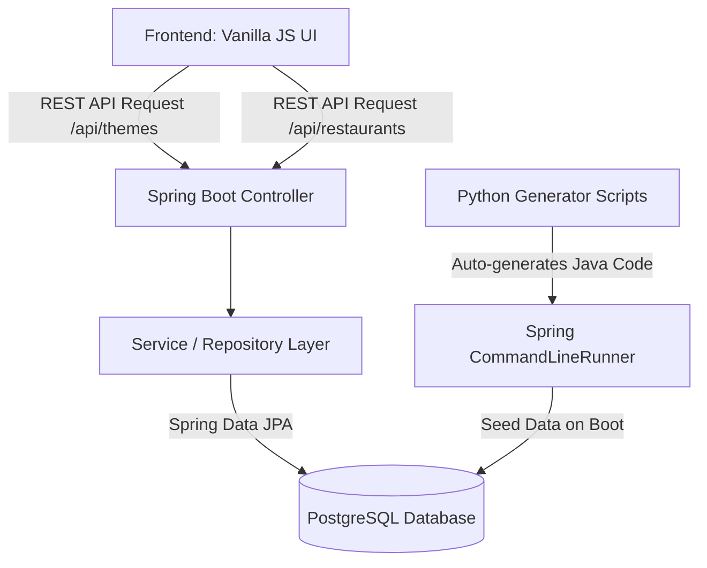

# Matchmaker 웹 서비스 (취향 맞춤형 맛집 큐레이션)

**Matchmaker**는 사용자의 기분, 상황, 그리고 세밀한 미식 취향을 분석하여 최적의 맛집을 찾아주는 **인터랙티브 큐레이션 웹 서비스**입니다. 초기에는 라멘 매니아(라오타)를 위한 정교한 라멘 추천 서비스로 시작하였으나, 현재는 비 오는 날의 전/국물 요리, 데이트 코스, 정통 멕시칸 타코까지 아우르는 확장 가능한 범용 큐레이션 플랫폼으로 진화했습니다.

---

## 1. 핵심 기능 (Core Features)

### 🎯 테마 기반 취향 퀴즈 및 텍스트 검색 (Interactive Quiz & Search)
* 사용자가 "비오는데 뭐드실?", "라오타의 라멘 추천", "빵집 추천" 등 원하는 테마를 선택하면, 상황에 맞는 동적인 UI가 전개됩니다.
* 기존의 **객관식 선택형 질문(Decision Tree)** 방식을 넘어, 빵집 추천 등 특정 테마에서는 **주관식 텍스트 입력 UI**를 동적으로 노출하여 사용자가 원하는 키워드(지역, 빵 종류)를 직접 검색할 수 있도록 하이브리드 UX를 지원합니다.

### 🧠 다중 매칭 알고리즘 (Hybrid Matching)
* **리터럴 타입 파티션 매칭**: 퀴즈의 최종 결과를 수학적 카테고리 조합(`FoodCategory`, `DetailStyle`, `MainIngredient`)으로 치환하여 데이터베이스에서 즉시 일치하는 식당을 추출합니다.
* **유연한 텍스트 검색(Fuzzy Matching)**: 주관식 입력의 경우, 사용자가 입력한 키워드를 바탕으로 메뉴 특징, 위치, 시그니처 메뉴 등을 `LIKE` 패턴으로 매칭하여 유연한 검색 결과를 제공합니다.

### 🗄️ 세밀한 다중 엔티티 데이터 모델링 (Advanced Data Modeling)
* 빵집과 같은 고도화된 미식 데이터 처리를 위해, 단순한 1차원 테이블 구조를 탈피했습니다.
* 핵심 빵집 정보(`Bakery`), 방문 실용/운영 정보(`BakeryOperation`), 그리고 타 매장과의 대조 정보(`BakeryComparison`)를 분할 매핑하여 풍부한 UI 렌더링(부정 리뷰 토글, 웨이팅 정보 뱃지 등)을 뒷받침합니다.

### 🌐 단일 페이지 애플리케이션 (SPA) 경험
* 페이지의 새로고침 없이 Javascript를 통한 부드러운 DOM 조작으로 테마 선택 ➡️ 퀴즈 진행 ➡️ 결과 확인까지 유려하게 이어집니다.

---

## 2. 기술 스택 (Tech Stack)

### Backend
* **Language/Framework**: Java 17, Spring Boot 3.x
* **Database**: PostgreSQL (Supabase 연동), Spring Data JPA, Hibernate
* **Architecture**: RESTful API 아키텍처, MVC 패턴

### Frontend
* **Core**: Vanilla Javascript, HTML5
* **Styling**: Vanilla CSS (직관적이고 트렌디한 감성 위주, Tailwind 등 외부 라이브러리 배제)
* **Communication**: Fetch API를 활용한 비동기 백엔드 통신

### Automation & Pipeline
* **Data Seeding**: Python (제너레이터 스크립트를 통한 Java 엔티티 코드 자동 생성)

---

## 3. 시스템 아키텍처 (Architecture)

1. **프론트엔드 계층**: 사용자의 클릭이나 텍스트 입력에 따라 퀴즈 UI/검색폼을 렌더링하고, 최종적으로 백엔드 매칭 API(`/api/restaurants` 또는 `/api/match/bakery`)로 파라미터를 넘겨 결과를 받아 화면에 그립니다.
2. **백엔드 계층**: 프론트엔드의 요청을 받아 JPA 리포지토리의 커스텀 쿼리 및 유연한 `LIKE` 검색을 통해 해당하는 식당/빵집 데이터를 조회하고 JSON 형태로 안전하게 직렬화(Serialization)하여 반환합니다.
3. **데이터 초기화 (Seeding)**: 파이썬 스크립트 기반 생성기 및 TSV/JSON 데이터를 바탕으로, 빌드 시점에 Java `CommandLineRunner`가 구동되어 DB를 최신 상태로 유지합니다.

---

## 4. 확장성과 미래 방향 (Scalability)

이 서비스는 **질문지(Theme/Question)**와 **데이터(Restaurant/Bakery)**가 유연하게 분리된 상태로 설계되었습니다.
새로운 장르나 카테고리(예: 디저트 추천, 와인 바 등)를 추가할 때 확장성이 매우 뛰어납니다. 프론트엔드는 주관식/객관식 입력 타입을 동적으로 인지하며, 백엔드는 새로운 도메인 모델을 가볍게 연결하는 구조를 지향합니다.

> [!NOTE]
> 빵집 데이터베이스의 고도화된 수집 방식과 매칭 원리에 대한 상세한 내용은 [bakery_collection_methodology.md](file:///C:/Users/sangw/.gemini/antigravity/brain/b66d6635-7ef1-478d-a0b1-d5a78d2a1413/bakery_collection_methodology.md) 문서를 참고해 주십시오.
